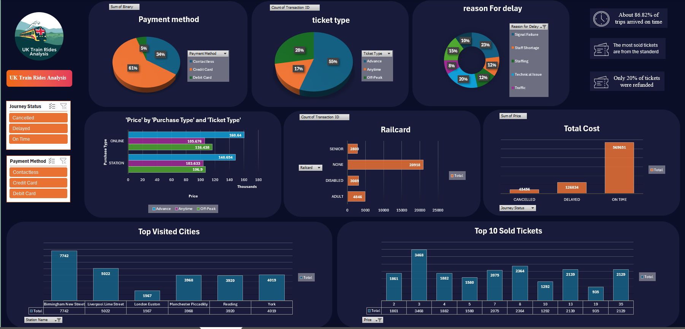

# UK Train Rides Data Analysis

## Team Members
1. Ahmed Ayman Soliman
2. Reem Osama Elhanafi
3. Shaimaa Hesham Abdelmonem
4. Yasmin Mostafa Abdelaziem

## Project Overview

This project focuses on analyzing UK train rides using raw railway data. The analysis includes statistical insights, a structured data model, visualizations, and a dashboard to better understand train ride patterns in the UK.

## Repository Structure

- **Raw Data/railway.csv** - The raw dataset containing UK train ride data.
- **Raw Data/railway_data_dictionary.csv** - A description of the dataset, including explanations of columns and data types.
- **Data Schema (python)/RailWay_Tables.py** - A Python script that processes the raw dataset and divides it into sub-tables for structured analysis.
- **Final Analysis/UK_Train_Rides (round1_analysis).xlsx** - The complete analysis file, including:
  - Statistical analysis
  - Data model & star schema
  - Visualizations
  - Interactive dashboard

## Project Workflow
1. **Data Exploration**: Understanding the dataset using the data dictionary.
2. **Data Processing**: Using `RailWay_Tables.py` to structure the data into sub-tables.
3. **Data Analysis**:
   - Performing statistical analysis on train rides.
   - Building a data model using a star schema for efficient querying.
4. **Visualization & Dashboard**:
   - Creating visualizations to identify trends and patterns.
   - Designing a dashboard for interactive insights.

## How to Use
1. Load `railway.csv` for raw data.
2. Use `RailWay_Tables.py` to process and organize the data.
3. Open `UK_Train_Rides (round1_analysis).xlsx` to explore the results and insights.

## Requirements
- Python 3.x
- Pandas, NumPy (for data processing)
- Excel-compatible software (for viewing the analysis file)

